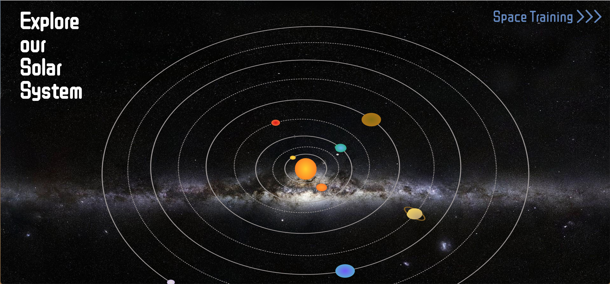
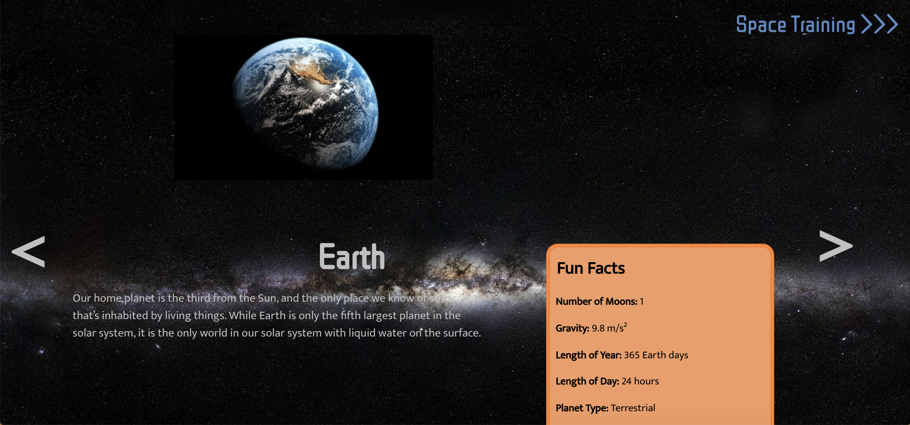
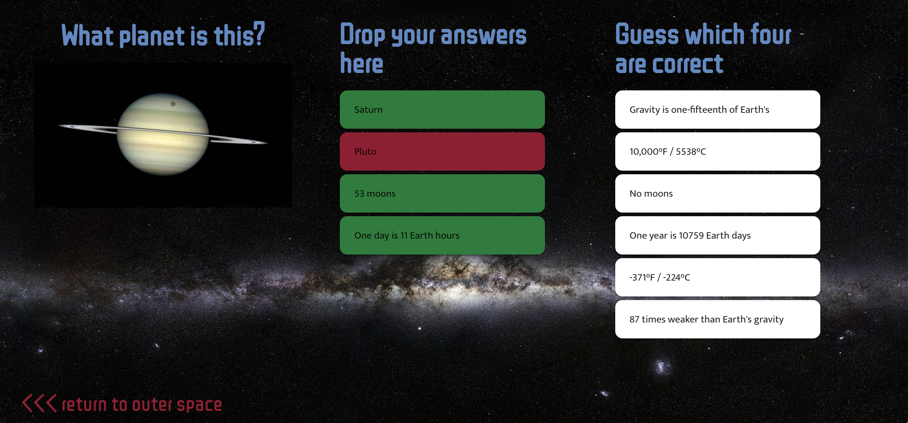
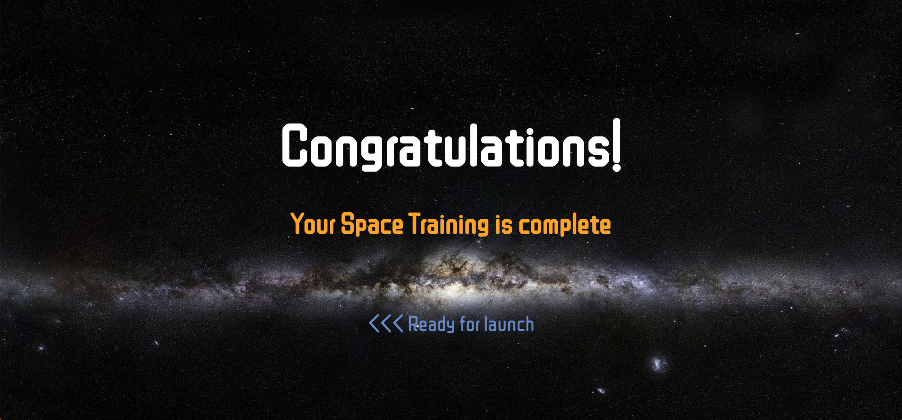

# Explore our Solar System
**Team Project: 3 contributors**

## The Project
Our brief was to build a full-stack JavaScript Vue application using MongoDB and Express according to a specified MVP brief.

[Project Brief](./education_app.md)

We created an educational app deigned for kids to engage with and learn about the heavenly bodies in our solar system. The homepage displays an animated solar system with planets orbiting around the sun. Users can click on planets to learn fun facts and then take the space training quiz to consolidate their knowledge.

## Screen Grabs

## Installation instructions

[Client](./client/README.md)

[Server](./server/README.md)
